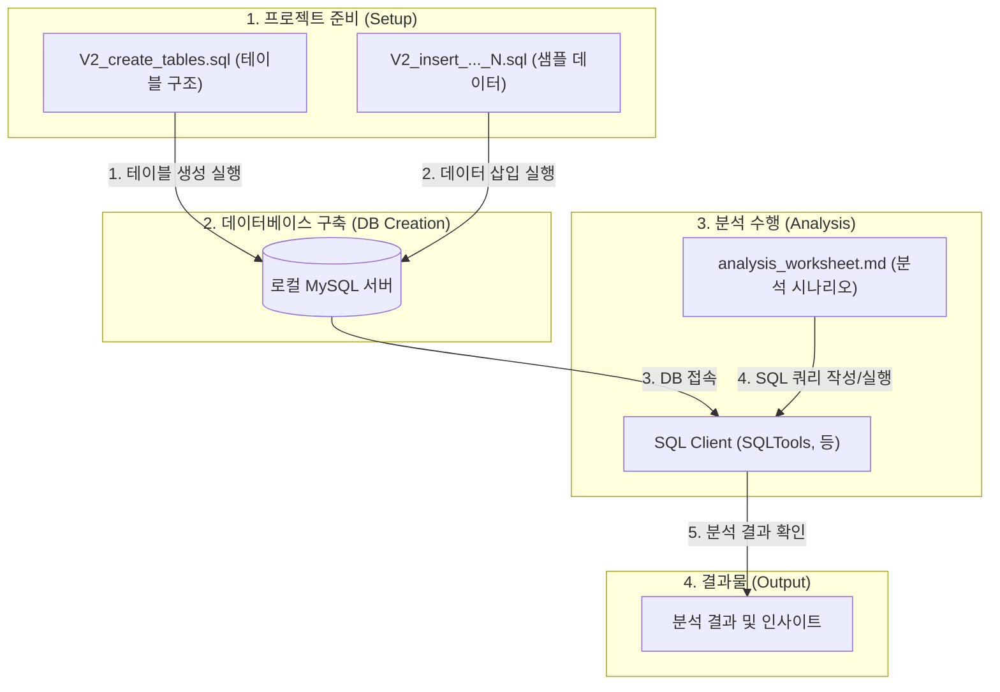
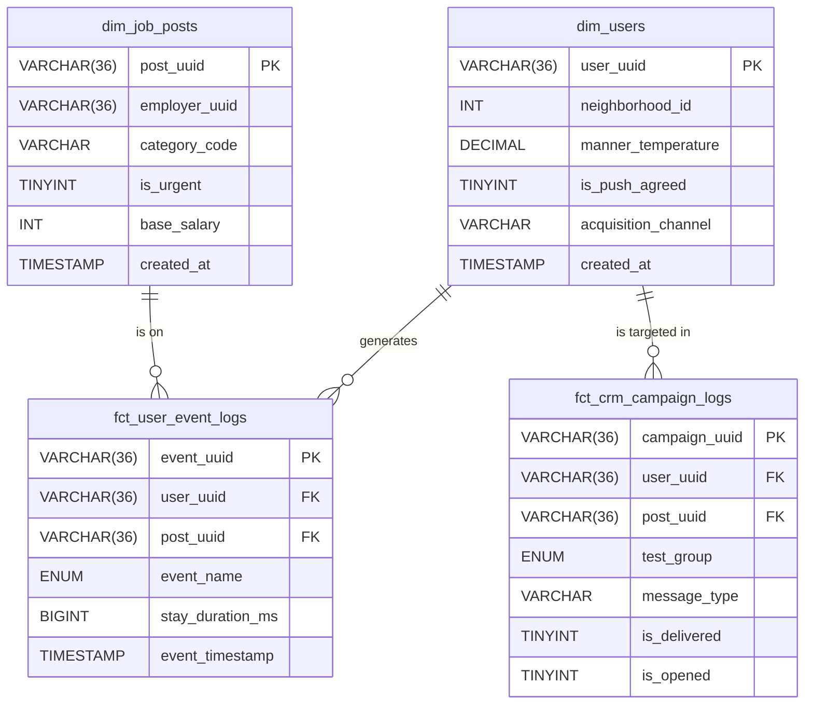

# 당근알바 CRM 성과 분석 프로젝트

본 프로젝트는 '당근알바' 서비스의 '신규 공고 미매칭' 문제를 해결하기 위한 CRM 캠페인의 효과를 분석하고, 그 과정을 재현하기 위한 데이터셋 및 분석 스크립트를 제공합니다.

분석의 전 과정은 실제 현업의 데이터 분석 환경을 상정하여, 확장성을 고려한 스타 스키마(Star Schema) 구조의 데이터 모델 위에서 수행됩니다.

---

## 🏗️ Architecture

### 1. 분석 아키텍처 (Analysis Architecture)
본 프로젝트는 데이터베이스 구축부터 최종 분석까지 아래와 같은 흐름으로 진행됩니다.



### 2. 데이터베이스 아키텍처 (DB Architecture - Star Schema)
분석 효율성과 확장성을 고려하여 설계된 스타 스키마 구조의 Entity-Relationship Diagram 입니다.



---

## 🚀 Project Goals & Scope

본 프로젝트는 아래의 분석 목표를 단계적으로 수행합니다.

1.  **Problem Definition:** '24시간 내 공고 미매칭률'을 핵심 문제 지표로 정의하고, 퍼널 분석을 통해 구체적인 병목 구간을 진단합니다.
2.  **A/B Test Design:** 문제 해결을 위한 가설을 수립하고, 타겟 그룹을 정의하며, 통계적 신뢰도를 확보하기 위한 최소 표본 크기를 산출합니다.
3.  **Performance Analysis:** A/B 테스트 결과를 바탕으로 캠페인의 효과(전환율 리프트)와 부작용(알림 차단율 등)을 측정하고, 통계적 유의성을 검증합니다.
4.  **Advanced Analysis:** 코호트 분석을 통해 캠페인의 장기적인 효과를 측정하는 등, 추가적인 비즈니스 인사이트를 도출합니다.

---

## 🛠️ How to Reproduce

이 프로젝트의 분석 환경을 로컬 컴퓨터에 그대로 재현하는 방법입니다.

**Prerequisites:**
- `XAMPP` (또는 다른 MySQL 서버) 설치 및 실행
- `VSCode` 및 `SQLTools` 확장 프로그램 설치

**Steps:**

1.  **데이터베이스 생성**
    - MySQL 클라이언트에 `root` 계정으로 접속합니다.
    - 아래 명령어를 실행하여 분석용 데이터베이스를 생성합니다.
      ```sql
      CREATE DATABASE carrot_analysis CHARACTER SET utf8mb4 COLLATE utf8mb4_unicode_ci;
      ```

2.  **테이블 생성**
    - SQLTools를 `carrot_analysis` 데이터베이스에 연결합니다.
    - `sql/V2_create_tables.sql` 파일을 열고, 파일 전체를 실행합니다.

3.  **데이터 삽입**
    - `sql/` 폴더에 있는 `V2_final_insert_...` 로 시작하는 모든 SQL 파일들을 **이름 순서대로, 하나씩** 전체 실행합니다.

4.  **분석 시작**
    - `analysis_worksheet.md` 파일을 열고, 각 미션에 맞는 SQL 쿼리를 SQLTools에서 직접 실행하며 분석을 시작합니다.

---

## 📁 Project Structure

```
.
├── docs/
│   └── project_summary.md  # 프로젝트의 상세 설계 및 분석 로직이 담긴 마스터 문서
├── sql/
│   ├── V2_create_tables.sql     # 테이블 구조(DDL) 스크립트
│   └── V2_final_insert_*.sql  # 분할된 데이터 삽입(DML) 스크립트
├── analysis_worksheet.md      # 직접 SQL을 채워나가는 시나리오 기반 분석 워크시트
└── README.md                  # 프로젝트 개요 및 가이드 (현재 파일)
```