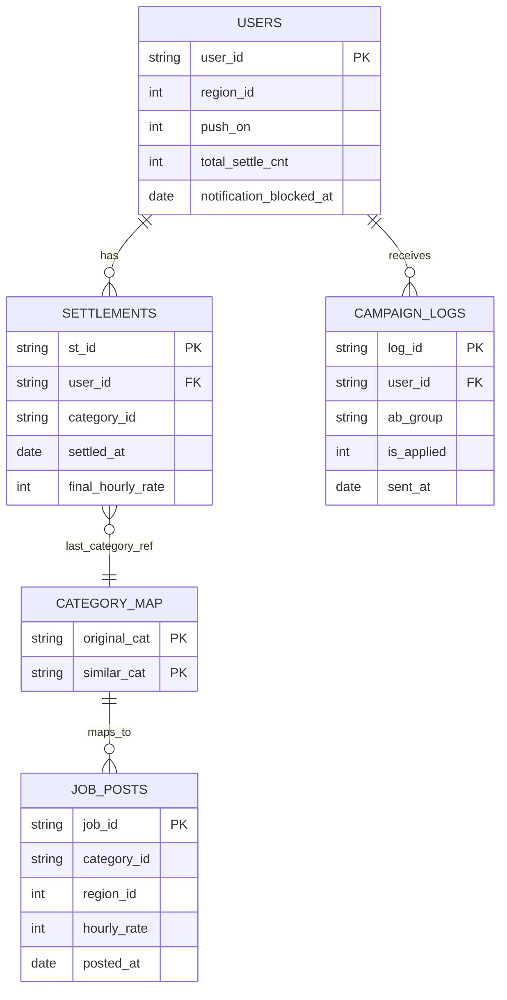

# Carrot Market CRM Reactivation Analysis Scenario

## A. 목표
- 자주 이용하던 사용자의 활동 중단 위험을 조기 식별하고, 고위험군 대상 CRM 캠페인의 성과를 검증한다.
- 기준일: `2023-10-26`

## B. 데이터 구성
- `users.csv`: `10000 x 5`
- `settlements.csv`: `49715 x 5`
- `job_posts.csv`: `3000 x 5`
- `category_map.csv`: `16 x 2`
- `campaign_logs.csv`: `13046 x 5`

핵심 컬럼:
- `users`: `user_id`, `region_id`, `push_on`, `total_settle_cnt`, `notification_blocked_at`
- `settlements`: `st_id`, `user_id`, `category_id`, `settled_at`, `final_hourly_rate`
- `job_posts`: `job_id`, `category_id`, `region_id`, `hourly_rate`, `posted_at`
- `category_map`: `original_cat`, `similar_cat`
- `campaign_logs`: `log_id`, `user_id`, `ab_group`, `is_applied`, `sent_at`

## C. 아키텍처 도식


## D. 분석 흐름 (상세)
1. 전체 10,000명에서 활동주기/최근성을 계산해 고위험군을 정의한다.
2. 고위험군 내부를 Light/Regular/Power 세그먼트로 나누고, 세그먼트별 Q3 임계값을 적용한다.
3. 캠페인 타겟은 고위험군으로 한정하고, 세그먼트 내부에서 Control/A/B를 균등 배정한다.
4. 타겟 매칭은 두 단계로 분리한다.
   - 잠재 매칭: 고위험군 전체에서 추천 가능 풀 진단
   - 실행 매칭: 실제 A/B 발송 대상에서 개인화 공고 확정
5. AB 성과는 `apply_rate`, `uplift_vs_control`, `chi-square p-value`로 판단한다.
6. 가드레일은 동일 타겟에서 `notification blocking rate`를 함께 본다.
7. 코호트 리텐션은 보조 지표로 후행 관찰한다.

## E. 고위험군 정의
- 코드: `sql/V2_step1_churn_definition.sql`
- 판정 로직: `recency_days > 티어별 Q3(avg_settle_cycle)`

결과(실측):
- 전체 티어 분포: Light `3053`, Regular `5337`, Power `1610`
- 평가 가능 유저: `9173`
- 고위험군: `2536` (27.65%)
- 고위험군 티어 분포: Light `506`, Regular `1350`, Power `680`
- 티어별 Q3: Light `26.8`, Regular `22.75`, Power `18.25`

## F. 개인화 타겟 선정
- 잠재 매칭 코드: `sql/V2_step2_personalization_matching.sql`
- 실행 매칭 코드: `sql/V2_step2b_personalization_matching_executable.sql`
- 공통 조건:
  - 고위험군 대상
  - 지역 일치 (`job.region_id = user.region_id`)
  - 시급 10% 이상 상승 (`job.hourly_rate >= last_rate * 1.10`)

잠재 매칭 결과(진단용):
- 고위험군 `2536` 중 매칭 성공 `2104`, 미매칭 `432`
- 총 매칭 공고 수: `28,491`
- 매칭 유저 1인당 평균 공고 수: `13.541` (중앙값 `9`)

실행 매칭 결과(발송용, A/B만):
- A/B 실행 대상: `1690` (A `846`, B `844`)
- 실행 매칭 유저: `1411`
- 총 매칭 공고 수: `19,470`
- 매칭 유저 1인당 평균 공고 수: `13.799` (중앙값 `9`)

## G. 메시지 정의 (A/B 분리)
- Control: 기준 메시지(비교군, 개인화 미적용)
- A: 유사 업종 강조 메시지
- B: 시급 상승 강조 메시지

A 메시지 예시(JSON):
```json
{
  "user_id": 101,
  "ab_group": "A",
  "title": "최근 하신 일과 비슷한 공고가 올라왔어요",
  "body": "유사 업종 공고를 확인해보세요.",
  "recommended_jobs": [2301, 9912, 10455],
  "message_basis": "similar_category"
}
```

B 메시지 예시(JSON):
```json
{
  "user_id": 101,
  "ab_group": "B",
  "title": "이전보다 시급이 높은 공고가 있어요",
  "body": "시급 상승 조건을 충족한 공고를 확인해보세요.",
  "recommended_jobs": [2301, 9912, 10455],
  "message_basis": "wage_uplift"
}
```

## H. AB 테스트 설계 및 시뮬레이션 가정
- 코드: `sql/V2_step3_ab_test_performance.sql`
- 1차 가설:
  - H0: Control/A/B의 `apply_rate`는 동일
  - H1: 최소 1개 그룹의 `apply_rate`가 다름
- 할당 방식:
  - 고위험군 세그먼트 내부 균등 배정 (stratified balance)
- 용어 정의(중요):
  - `매칭 시`: 해당 유저에게 개인화 조건을 만족하는 공고가 1개 이상 있을 때
  - `비매칭 시`: 개인화 조건(업종/지역/시급)을 만족하는 공고가 0개일 때
  - 즉, 같은 A/B 그룹이어도 유저별 추천 가능 여부에 따라 반응 확률을 다르게 가정함
- 초기 반응 확률 가정(시뮬레이션):
  - Control: `0.02`
  - A:
    - 매칭 시 `0.06` (유사 업종 추천이 실제로 존재)
    - 비매칭 시 `0.03` (개인화 혜택이 약한 상태)
  - B:
    - 매칭 시 `0.14` (시급 상승 공고가 실제로 존재)
    - 비매칭 시 `0.04` (시급 상승 혜택이 없는 상태)
- 예시:
  - A 유저가 유사 업종 공고를 1개 이상 받으면 `0.06`, 없으면 `0.03`
  - B 유저가 시급 10% 이상 공고를 1개 이상 받으면 `0.14`, 없으면 `0.04`
- 후속 반응 확률 가정(리텐션 로그 생성):
  - Base `0.05`, A `0.09`, B `0.16`
  - B가 초기 반응한 경우 후속 확률 `1.3x` (상한 `0.30`)

## I. AB 결과 + 가드레일
AB 성과(고위험군 타겟):
- 그룹 분포: Control `846`, A `846`, B `844`
- 세그먼트 내 균등 배정:
  - Light: Control `169`, A `169`, B `168`
  - Regular: Control `450`, A `450`, B `450`
  - Power: Control `227`, A `227`, B `226`
- apply_rate:
  - Control `20/846` = `0.023641`
  - A `45/846` = `0.053191` (`uplift=+0.029551`)
  - B `121/844` = `0.143365` (`uplift=+0.119724`)
- 카이제곱(3x2): `chi2=96.692068`, `df=2`, `p=1.008e-21`

가드레일(고위험군 타겟, notification_blocking_rate):
- Control `8.274232%`
- A `10.756501%`
- B `10.308057%`

## J. 코호트 리텐션 (보조 지표)
- 코드: `sql/V2_step4_cohort_analysis.sql`
- Post 코호트(실측):
  - Week1 `0.0927`
  - Week2 `0.1045`
  - Week4 `0.1124`

## K. 의사결정 기준
1. `uplift`와 `p-value`를 동시에 충족하는지 확인
2. 가드레일(차단율) 악화가 허용 범위 내인지 확인
3. 전환-피로도 균형 기준으로 운영안 확정
