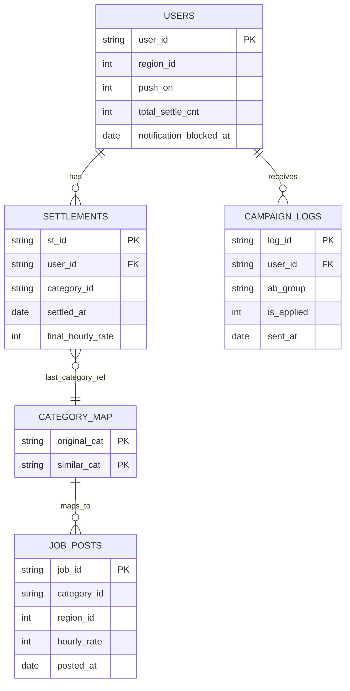

# Carrot Market CRM Reactivation Analysis Scenario (A-Z)

## A. 목표
- 자주 이용하던 사용자의 활동 중단 위험을 조기 식별하고, 고위험군 대상 CRM 캠페인의 성과를 검증한다.
- 기준일: `2023-10-26`

## B. 데이터 구성
- `users.csv`: `10000 x 5`
- `settlements.csv`: `49715 x 5`
- `job_posts.csv`: `3000 x 5`
- `category_map.csv`: `16 x 2`
- `campaign_logs.csv`: `13046 x 5`

핵심 컬럼:
- `users`: `user_id`, `region_id`, `push_on`, `total_settle_cnt`, `notification_blocked_at`
- `settlements`: `st_id`, `user_id`, `category_id`, `settled_at`, `final_hourly_rate`
- `job_posts`: `job_id`, `category_id`, `region_id`, `hourly_rate`, `posted_at`
- `category_map`: `original_cat`, `similar_cat`
- `campaign_logs`: `log_id`, `user_id`, `ab_group`, `is_applied`, `sent_at`

## C. 아키텍처 도식


## D. 분석 흐름 (모수 순서)
1. 전체 10,000명에서 STEP1로 고위험군 정의
2. 고위험군만 캠페인 타겟으로 선정
3. 고위험군 세그먼트(Light/Regular/Power) 내부에서 Control/A/B 균등 배정
4. STEP2(잠재 매칭)와 STEP2b(실행 매칭)를 분리
5. STEP3/STEP5는 실행 대상 기준으로 성과·가드레일 검증

---

## E. STEP1 고위험군 정의
- 코드: `sql/V2_step1_churn_definition.sql`
- 판정 로직: `recency_days > 티어별 Q3(avg_settle_cycle)`

결과(실측):
- 전체 티어 분포: Light `3053`, Regular `5337`, Power `1610`
- 평가 가능 유저: `9173`
- 고위험군: `2536` (27.65%)
- 고위험군 티어 분포: Light `506`, Regular `1350`, Power `680`
- 티어별 Q3: Light `26.8`, Regular `22.75`, Power `18.25`

## F. STEP2 잠재 매칭 (진단용)
- 코드: `sql/V2_step2_personalization_matching.sql`
- 목적: 고위험군 전체에서 추천 가능 풀의 잠재 규모 확인
- 조건:
  - high-risk only
  - 지역 일치 (`job.region_id = user.region_id`)
  - 시급 10% 이상 상승 (`job.hourly_rate >= last_rate * 1.10`)

결과(실측):
- 고위험군 `2536` 중 매칭 성공 `2104`, 미매칭 `432`
- 추천 후보(유저-공고): `28,491`
- 유저당 평균 추천 수(매칭 유저 기준): `13.541` (중앙값 `9`)

## G. STEP2b 실행 매칭 (발송용)
- 코드: `sql/V2_step2b_personalization_matching_executable.sql`
- 목적: 실제 개인화 메시지를 보내는 실행 대상(A/B) 기준 매칭
- 대상: 기준일 A/B 수신자만 (`ab_group in ('A','B')`)

결과(실측):
- A/B 실행 대상: `1690` (A `846`, B `844`)
- 실행 매칭 유저: `1411`
- 실행 추천 후보(유저-공고): `19,470`

## H. A/B 메시지 정의 (분리)
- Control: 기준 메시지(비교군)
- A: 유사 업종 강조 메시지
- B: 시급 상승 강조 메시지

A 메시지 예시(JSON):
```json
{
  "user_id": 101,
  "ab_group": "A",
  "title": "최근 하신 일과 비슷한 공고가 올라왔어요",
  "body": "유사 업종 공고를 확인해보세요.",
  "recommended_jobs": [2301, 9912, 10455],
  "message_basis": "similar_category"
}
```

B 메시지 예시(JSON):
```json
{
  "user_id": 101,
  "ab_group": "B",
  "title": "이전보다 시급이 높은 공고가 있어요",
  "body": "시급 상승 조건을 충족한 공고를 확인해보세요.",
  "recommended_jobs": [2301, 9912, 10455],
  "message_basis": "wage_uplift"
}
```

업종/시급 구조:
- 업종 유사성: `category_map` 사용
- 시급 조건: 별도 테이블 없이 계산식으로 처리

## I. STEP3 AB 성과 (고위험군 타겟)
- 코드: `sql/V2_step3_ab_test_performance.sql`
- 1차 가설:
  - H0: Control/A/B apply_rate 동일
  - H1: 최소 1개 그룹 apply_rate 상이

분석 모수:
- 고위험군 타겟 `N=2536`
- 그룹 분포: Control `846`, A `846`, B `844`

세그먼트 내 균등 배정 확인:
- Light: Control `169`, A `169`, B `168`
- Regular: Control `450`, A `450`, B `450`
- Power: Control `227`, A `227`, B `226`

성과(실측):
- Control: `20/846`, `apply_rate=0.023641`
- A: `45/846`, `apply_rate=0.053191`, `uplift=+0.029551`
- B: `121/844`, `apply_rate=0.143365`, `uplift=+0.119724`
- 카이제곱(3x2): `chi2=96.692068`, `df=2`, `p=1.008e-21`

## J. STEP4 코호트 리텐션
- 코드: `sql/V2_step4_cohort_analysis.sql`
- Post 코호트(실측): Week1 `0.0927`, Week2 `0.1045`, Week4 `0.1124`

## K. STEP5 가드레일 (고위험군 타겟)
- 코드: `sql/V2_step5_guardrail_metrics.sql`
- 차단율(실측):
  - Control `8.274232%`
  - A `10.756501%`
  - B `10.308057%`

## L. 의사결정 프레임
1. STEP3에서 uplift + 유의성 확인
2. STEP5에서 차단율 악화 여부 확인
3. 전환-피로도 균형 기준으로 운영안 확정

## M. 정합성 점검 방식
- 문서 수치는 SQL 실행 결과를 기준으로 기록한다.
- 동일 CSV 입력 + 동일 SQL 실행 순서로 결과 재현 가능하다.

