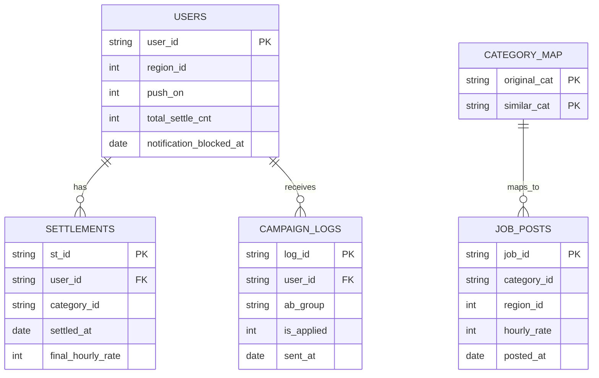
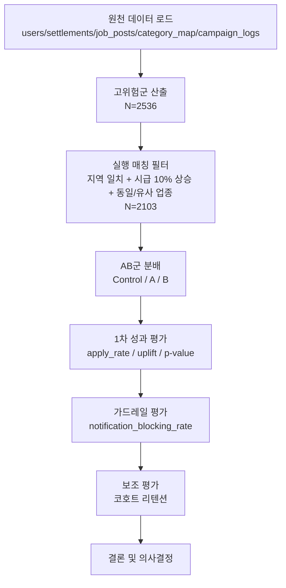

# Carrot Market CRM Reactivation Analysis Scenario

## A. 목표
- 자주 이용하던 사용자의 활동 중단 위험을 조기 식별하고, 고위험군 대상 CRM 캠페인의 성과를 검증한다.
- 기준일: `2023-10-26`

## B. 데이터 구성
| 테이블 | 한 줄 설명(역할) | 주요 키 | 분석에서 쓰는 단계 |
|---|---|---|---|
| `users` | 유저 기본 속성/알림 상태/누적 활동량 기준 테이블 | `user_id` | E(고위험군), F(타겟 선정), J(코호트) |
| `settlements` | 유저 과거 근무/정산 이력으로 활동주기와 최근성을 계산하는 근거 테이블 | `st_id`, `user_id` | E(고위험군), F(시급 상승 조건), J(리텐션 활동) |
| `job_posts` | 개인화 매칭 후보 공고를 담은 테이블(지역/시급 조건 평가) | `job_id`, `category_id`, `region_id` | F(실행 매칭) |
| `category_map` | 동일 업종 외 유사 업종까지 확장하기 위한 매핑 사전 | `original_cat`, `similar_cat` | F(유사 업종 매칭), G/H(A 실험 근거) |
| `campaign_logs` | 실험군 배정, 발송 이력, 지원 반응을 담는 로그 테이블 | `log_id`, `user_id`, `ab_group` | H(실험 설계), I(AB 결과), J(코호트) |

- 파일 크기:
  - `users.csv`: `10000 x 5`
  - `settlements.csv`: `49715 x 5`
  - `job_posts.csv`: `3000 x 5`
  - `category_map.csv`: `16 x 2`
  - `campaign_logs.csv`: `3321 x 5`
- 이 문서에서 모집단 정의 시 가장 많이 쓰는 키: `user_id`
- 핵심 컬럼(축약):
  - `users`: `user_id`, `region_id`, `push_on`, `total_settle_cnt`, `notification_blocked_at`
  - `settlements`: `st_id`, `user_id`, `category_id`, `settled_at`, `final_hourly_rate`
  - `job_posts`: `job_id`, `category_id`, `region_id`, `hourly_rate`, `posted_at`
  - `category_map`: `original_cat`, `similar_cat`
  - `campaign_logs`: `log_id`, `user_id`, `ab_group`, `is_applied`, `sent_at`

## C. 아키텍처 도식


## D. 분석 흐름 (도식 + 상세)


> AB 성과(I)와 가드레일(I), 코호트(J)의 Post 기준 모집단은 실행 매칭 성립 유저 `2103`으로 통일한다.

1. 전체 사용자에서 활동주기/최근성을 계산해 고위험군을 정의한다.
2. 고위험군을 Light/Regular/Power로 구분하고, 세그먼트별 Q3 임계값을 적용한다.
3. 고위험군 중 개인화 실행 조건(지역 일치 AND 시급 10% 상승 AND 동일/유사 업종)을 충족한 유저만 실행 타겟으로 확정한다.
4. 실행 타겟에서 `Control/A/B`를 비교하며, `A`는 유사 업종 강조 메시지, `B`는 시급 상승 강조 메시지를 의미한다.
5. AB 성과와 가드레일은 동일 모집단(실행 타겟)에서 함께 비교한다.
6. 주요 메트릭은 `apply_rate`, `uplift_vs_control`, `chi-square p-value`, `notification_blocking_rate`다.
7. 코호트 리텐션은 보조 지표로 후행 관찰한다.

## E. 고위험군 정의
- 코드: `sql/V2_step1_churn_definition.sql`
- 판정 로직: `recency_days > 티어별 Q3(avg_settle_cycle)`

결과(실측):
- 전체 티어 분포: Light `3053`, Regular `5337`, Power `1610`
- 평가 가능 유저(주기 계산 가능): `9173`
- 고위험군: `2536` (27.65%)
- 고위험군 티어 분포: Light `506`, Regular `1350`, Power `680`
- 티어별 Q3: Light `26.8`, Regular `22.75`, Power `18.25`

## F. 개인화 타겟 선정
- 잠재 매칭 코드: `sql/V2_step2_personalization_matching.sql`
- 실행 매칭 코드: `sql/V2_step2b_personalization_matching_executable.sql`
- 공통 조건:
  - 고위험군 대상
  - 지역 일치 (`job.region_id = user.region_id`)
  - 시급 10% 이상 상승 (`job.hourly_rate >= last_rate * 1.10`)
  - 동일/유사 업종 (`category_map` 활용)

결과(실측):
- 고위험군 `2536` 중 실행 가능 매칭 유저 `2103`
- 총 매칭 공고 수: `28528`
- 매칭 유저 1인당 평균 공고 수: `13.565` (중앙값 `9`)

## G. 메시지 정의 (A/B 분리)
- Control: 기준 메시지(비교군, 개인화 미적용)
- A: 유사 업종 강조 메시지
- B: 시급 상승 강조 메시지

A 메시지 예시(JSON):
```json
{
  "user_id": "user_101",
  "ab_group": "A",
  "title": "최근 하신 일과 비슷한 공고가 올라왔어요",
  "body": "같은 지역의 유사 업종 공고를 확인해보세요.",
  "message_basis": "similar_category"
}
```

B 메시지 예시(JSON):
```json
{
  "user_id": "user_101",
  "ab_group": "B",
  "title": "이전보다 시급이 높은 공고가 있어요",
  "body": "최근 정산 시급 대비 10% 이상 높은 공고를 확인해보세요.",
  "message_basis": "wage_uplift"
}
```

## H. AB 테스트 설계
- 코드: `sql/V2_step3_ab_test_performance.sql`
- 전체 검정 가설:
  - H0: Control/A/B의 `apply_rate`는 동일
  - H1: 최소 1개 그룹의 `apply_rate`가 다름
- 그룹별 방향 가설(실험 의도 명시):
  - H1-A: `A(유사업종 강조)`는 `Control(기준 메시지)` 대비 `apply_rate`를 증가시킬 것이다.
  - H1-B: `B(시급 상승 강조)`는 `Control(기준 메시지)` 대비 `apply_rate`를 증가시킬 것이다.
  - 탐색적 기대: `B`의 효과 크기가 `A`보다 클 가능성이 있다(사전 단정 아님).
- 모집단 정의(중요):
  - 기준일 발송 로그 중, 실행 매칭이 실제로 성립한 유저만 포함
  - 즉, 매칭 미성립 유저는 실험/성과 집계에서 제외
  - H/I/J(Post)는 모두 동일 모집단 `n=2103`을 사용
- 그룹 분포(실측):
  - Control `693`, A `713`, B `697` (합계 `2103`)

## I. AB 결과 + 가드레일
AB 성과(실행 매칭 성립 유저 `n=2103` 기준):

| 그룹 | 지원/전체 | apply_rate | uplift vs Control(기준 메시지) |
|---|---:|---:|---:|
| Control(기준 메시지) | `17/693` | `0.024531` | `-` |
| A(유사업종 강조) | `36/713` | `0.050491` | `+0.025960` |
| B(시급 상승 강조) | `114/697` | `0.163558` | `+0.139027` |

- 카이제곱(3x2): `chi2=104.218027`, `df=2`, `p=2.341e-23`
- 해석 메모: 표에서 그룹명과 실험 의미를 함께 표기해, 상단 섹션 역참조 없이도 결과 해석이 가능하다.

가드레일(동일 모집단, notification_blocking_rate):

| 그룹 | notification_blocking_rate |
|---|---:|
| Control(기준 메시지) | `8.658009%` |
| A(유사업종 강조) | `10.098177%` |
| B(시급 상승 강조) | `10.043041%` |

## J. 코호트 리텐션 (보조 지표)
- 코드: `sql/V2_step4_cohort_analysis.sql`
- 해석 원칙:
  - AB 1차 성과/가드레일 판단 이후, 중기 잔존 추세를 보조적으로 확인한다.
  - 모집단 정합성을 위해 Post 코호트는 실험 모집단(`n=2103`) 기준으로 본다.
- 모수 정의 정리:
  - `2536`: 고위험군 전체 모수(E 단계)
  - `2103`: 실행 매칭 성립 후 실험 모수(H/I/J Post 기준)

결과:
- Post-Experiment Cohort (`n=2103`): Week1 `9.2725%`, Week2 `10.1284%`, Week4 `11.1270%`
- Pre-Personalization Cohort (`n=4917`): Week1 `3.8641%`, Week2 `8.5215%`, Week4 `7.0165%`

## K. 의사결정 기준
1. `uplift`와 `p-value`를 함께 확인해 효과의 크기와 통계적 유의성을 동시에 본다.
2. 동일 모집단의 가드레일(차단율) 악화 폭이 허용 범위 내인지 확인한다.
3. 전환 개선과 사용자 피로도 사이의 균형 기준으로 운영안을 확정한다.

## L. 결론
### 1) 핵심 결론
- 본 실험에서는 `B(시급 상승 강조)` 메시지가 전환 개선 측면에서 최우선 운영안이다.

### 2) 수치 근거
- `B(시급 상승 강조)` apply_rate: `0.163558` (Control 대비 `+0.139027`)
- `A(유사업종 강조)` apply_rate: `0.050491` (Control 대비 `+0.025960`)
- 전체 그룹 차이 검정: `p=2.341e-23` (통계적으로 유의)
- 가드레일(notification_blocking_rate): Control `8.658009%`, A `10.098177%`, B `10.043041%`

### 3) 의사결정 해석
- 전환 성과는 `B`가 가장 크고 통계적으로도 유의하다. 다만 차단율은 Control 대비 A/B 모두 상승하므로, 운영 적용 시 피로도 허용 기준(예: 차단율 상한)을 함께 두고 모니터링해야 한다.
